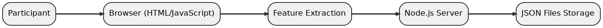
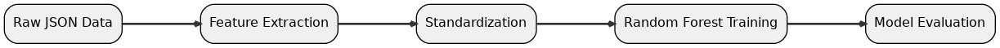
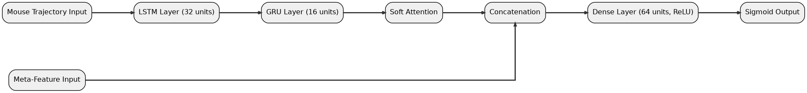
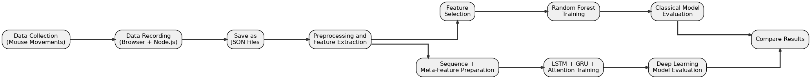

# 🎓 PROG2900 - Bachelor Thesis Project

[](https://github.com/nemanjant/PROG2900-Bachelor-project-2025)  
[](https://github.com/nemanjant/PROG2900-Bachelor-project-2025/fork)  
[](https://github.com/nemanjant/PROG2900-Bachelor-project-2025/commits/main)  
[](LICENSE)

**Title:** Cursor Dynamics for Deception Detection  
**Author:** Nemanja Tosic  
**Supervisor:** Kiran Raja  
**Company:** Mobai AS  

Norwegian University of Science and Technology  
Department of Computer Science  
Gjøvik, Spring 2025

---

## Abstract

This project looks at whether you can spot when someone’s lying by tracking tiny changes in their mouse movements while they answer yes/no questions. We built and tested two kinds of models—a Random Forest using hand-picked features and a combined LSTM-GRU network with attention—to see which one works better.

---

## Table of Contents

- [Background](#background)
- [Repository Structure](#repository-structure)
- [Installation](#installation)
- [Usage](#usage)
- [Methodology](#methodology)
- [Classical Model Architecture](#classical-model-architecture)
- [Deep Learning Architecture](#deep-learning-architecture)
- [Project Workflow](#project-workflow)
- [Results & Evaluation](#results--evaluation)
- [Conclusions](#conclusions)
- [References](#references)
- [Contributing](#contributing)
- [License](#license)
- [GitHub Stats](#github-stats)
- [Thesis](#thesis)

---

## Background

This repository hosts all code and data for the bachelor thesis *"Cursor Dynamics for Deception Detection"*. The study explores whether deceptive intent can be detected from mouse movement behavior, comparing a classical machine learning approach with a deep learning architecture.

---

## Repository Structure

<details>
<summary>Click to expand repository layout</summary>

```bash
PROG2900-Bachelor-project-2025/
├── classical_model_training/         # Classical Random Forest models
├── deep_learning_model_training/     # LSTM-GRU-Attention models and logs
├── data/                             # Raw mouse movement JSON files
├── data_analysys_stats/              # Visualization and statistical analysis scripts
├── public/                           # Frontend UI for data collection
├── server.js                         # Node.js backend for storing JSON data
├── package.json / lock               # Node.js config and dependencies
├── requirements.txt                  # Python dependencies
└── README.md                         # Project documentation (you are here)
```
</details>

---

## Installation

### 1. Clone the repository
```bash
git clone https://github.com/nemanjant/PROG2900-Bachelor-project-2025.git
cd PROG2900-Bachelor-project-2025
```

### 2. Install dependencies
Make sure you have Python 3.11 and Node.js installed:
```bash
npm install
pip install -r requirements.txt
```
---

## Usage

### 1. Data Collection
To run the local web experiment:
```bash
node server.js
```
Mouse movement responses will be saved as structured JSON files. After collection, sort files into `data/truthful/` and `data/deceitful/`.

### 2. Data Analysis
Use the scripts in `data_analysys_stats/utils/` to process and visualize data:
```bash
# Generate summary statistics
python average_mouse_stats.py

# Interpolate average cursor paths
python average_mouse_pattern_graphs.py

# Plot behavioral features
python average_mouse_stats_chart.py
python acj_plot_graphs.py
python acj_interpolation_plot.py
python jspk_plot_graphs.py

# Add class labels for modeling
python labeling_data_training.py
```
Outputs are saved in `data_analysys_stats/averaged_data/` and `graph_charts/`.


### 3. Model Training

#### Classical Model (Random Forest)
- **Baseline (80/20 split):**
```bash
python classical_model_training/model_training_rf_v1.py
```

- **5-Fold Cross-Validation:**
```bash
python classical_model_training/model_training_rf_cv_fold.py
```

#### Deep Learning Model (LSTM-GRU-Attention)
```bash
python deep_learning_model_training/model_training_lstm_gru_v2.py
```
Models are saved as `.h5` files with corresponding logs per fold.

---

## Data

The dataset includes 700 samples (350 truthful, 350 deceitful) collected from 35 participants. Each JSON file captures cursor movements, timestamps, and derived behavioral features:

- **Trajectory:** `mouseMovements`, `timestamps`, `velocity`, `acceleration`, `jerk`, `curvature`
- **Behavioral:** `pausePoints`, `hesitation`, `hesitationLevel`, `totalTime`, `averageSpeed`
- **Metadata:** `question`, `answer`, `label` (`0` = truthful, `1` = deceitful)

### Data Flow

<p align="center">
  
</p>

The diagram shows the flow of mouse data from collection to JSON storage.

---

## Methodology

Participants answered yes/no questions truthfully and deceitfully in a browser-based experiment. Mouse dynamics were recorded in real time using JavaScript and saved as JSON via a Node.js backend. Raw (x, y) cursor paths were processed into standardized feature sets including movement derivatives and behavioral summaries. Models were trained using stratified 5-fold cross-validation.<br />

### 1. Classical Model Architecture

<p align="center">
  
</p>

The diagram illustrates data processing and evaluation flow for the Random Forest model.<br />

### 2. Deep Learning Architecture

<p align="center">
  
</p>

The diagram presents the hybrid model combining LSTM, GRU, soft attention, and meta-feature fusion.<br />

### 3. Evaluation
Evaluation included accuracy, recall, macro F1-score, ROC/AUC, matrix correlations and feature importance.<br />

---

## Project Workflow

<p align="center">
  
</p>

This diagram illustrates the end-to-end workflow of the project, starting from data collection and recording, through preprocessing and feature extraction, branching into both classical (Random Forest) and deep learning (LSTM-GRU-Attention) training pipelines, and culminating in a final comparative evaluation of model performance.

The diagram summarizes data collection, feature extraction, model training, and evaluation.

---

## Results & Evaluation

### Collected Data Insights

- **Trajectory Patterns:** Truthful paths are smoother and more direct, while deceptive responses exhibit greater curvature, longer detours, and spatial deviation.  
- **Movement Duration:** Truthful trials averaged **2.48 s** compared to **2.07 s** for deceptive trials, indicating quicker termination of deceptive actions.  
- **Speed:** Average velocity was lower for truthful responses (355.7 px/s) than for deceptive ones (377.7 px/s), suggesting faster cursor motions when participants lied.  
- **Acceleration:** Deceptive trajectories show higher acceleration peaks in the early phase and larger fluctuations throughout, whereas truthful movement accelerations stabilize more quickly.  
- **Curvature:** Initial curvature is similar, but toward the end of the trajectory, deceptive paths curve more sharply, reflecting irregular directional changes.  
- **Jerk & Spikes:** Deceptive trials produced roughly **12 jerk spikes** (vs. **6** in truthful), and peak jerk values were higher, indicating more abrupt motion changes.  
- **Hesitation & Pauses:** Truthful responses had more hesitation events (3.23 vs. 2.53) and pauses (5.18 vs. 4.10), despite equal average pause duration (0.62 s), suggesting more deliberate processing when truthful.  

---

### Model Performance Summary

| Model                                    | Accuracy | Macro F1 | AUC  |
|------------------------------------------|----------|----------|------|
| **Random Forest (Baseline)**             | 58.6 %   | 0.58     | 0.60 |
| **Random Forest (5-Fold Average)**       | 57.7 %   | 0.576    | 0.62 |
| **LSTM–GRU–Attention (5-Fold Average)**  | 54.4 %   | 0.55     | 0.57 |
| **LSTM–GRU–Attention (Best Fold)**       | 62.1 %   | 0.62     | 0.65 |

- The Random Forest baseline achieves 58.6 % accuracy; across 5-fold CV it averaged 57.7 % accuracy, 0.576 macro F1, and 0.62 AUC.  
- The LSTM–GRU–Attention model averaged 54.4 % accuracy, 0.55 macro F1, and 0.57 AUC across folds; its best fold reached 62.1 % accuracy, 0.62 macro F1, and 0.65 AUC.  
- A paired t-test on the five macro F1 scores (p = 0.462) indicates no statistically significant difference in overall performance.

---

### Model Comparison

To evaluate both approaches under consistent conditions, we used the same 5-fold stratified splits:

- **Consistency:** Random Forest yielded higher macro F1 in 4 of 5 folds, demonstrating more stable performance across splits. The LSTM–GRU–Attention network achieved its highest score only in Fold 4.  
- **Peak vs. Average:** Although the deep sequence model surpassed the classical baseline in its best fold (62.1 % vs. 58.6 % accuracy), its lower average highlights sensitivity to data partitioning.  
- **Statistical Significance:** The paired t-test (p = 0.462) confirms no significant difference in average fold performance, suggesting comparable overall reliability.  
- **Practical Guidance:** For consistent, reliable deployment, Random Forest may be preferable; when maximum accuracy is critical and ample data is available, the deep model offers higher peak performance.

---  

## Conclusions

This study demonstrates that subtle differences in mouse cursor dynamics can provide meaningful signals of deceptive intent. Key findings include:

- **Behavioral Indicators:** Deceptive responses tend to be faster overall, exhibit higher acceleration and jerk variability, and show increased curvature in the latter phase of movement. Truthful responses, by contrast, involve more pauses and hesitation events, suggesting more deliberate processing.
- **Model Comparison:**  
  - The classical Random Forest classifier delivered stable performance across all folds (≈57.7 % accuracy, 0.576 macro F1, 0.62 AUC), making it a reliable baseline.  
  - The LSTM–GRU–Attention network achieved a higher peak performance in its best fold (62.1 % accuracy, 0.62 macro F1, 0.65 AUC) but was more sensitive to data splits.
- **Practical Implications:** For applications requiring consistency and ease of deployment, the Random Forest approach is recommended. When aiming for maximum accuracy and sufficient training data is available, deep sequence models can yield superior peak results.

**Future Work:**  
1. **Data Expansion:** Collect larger and more diverse datasets to improve model generalization.  
2. **Feature Fusion:** Combine cursor dynamics with other behavioral or physiological signals (e.g., keystroke timing, gaze tracking).  
3. **Real-Time Detection:** Explore online prediction frameworks for real-time deception detection in interactive systems.

---

## References

- C. Mazza, M. Monaro, F. Burla, M. Colasanti, G. Orrù, S. Ferracuti, and P. Roma, “Use of mouse-tracking software to detect faking-good behavior on personality questionnaires: An explorative study,” *Scientific Reports*, vol. 10, p. 4835, 2020. doi:10.1038/s41598-020-61636-5. [Online]. Available: https://doi.org/10.1038/s41598-020-61636-5

- M. Pusara and C. E. Brodley, “User re-authentication via mouse movements,” in *Proceedings of the 2004 ACM Workshop on Visualization and Data Mining for Computer Security (VizSEC/DMSEC)*, Washington, DC, USA: ACM, 2004, pp. 1–8, isbn:1-58113-974-8. doi:10.1145/1029208.1029210. [Online]. Available: https://www.researchgate.net/publication/221325920

- P. Zimmermann, S. Guttormsen, B. Danuser, and P. Gomez, “Affective computing – a rationale for measuring mood with mouse and keyboard,” *International Journal of Occupational Safety and Ergonomics (JOSE)*, vol. 9, no. 4, pp. 539–551, 2003. doi:10.1080/10803548.2003.11076589. [Online]. Available: https://doi.org/10.1080/10803548.2003.11076589

- S. Khan, C. Devlen, M. Manno, and D. Hou, “Mouse dynamics behavioral biometrics: A survey,” *ACM Computing Surveys*, vol. 37, no. 4, Article 111, pp. 1–32, 2023. doi:10.48550/arXiv.2208.09061. [Online]. Available: https://doi.org/10.1145/3640311

- M. Zuckerman, B. M. DePaulo, and R. Rosenthal, “Verbal and nonverbal communication of deception,” in *Advances in Experimental Social Psychology*, L. Berkowitz, Ed., vol. 14, Academic Press, 1981, pp. 1–59. doi:10.1016/S0065-2601(08)60369-X

- M. Monaro, L. Gamberini, and G. Sartori, “Spotting faked identities via mouse dynamics using complex questions,” in *Proceedings of the British HCI 2018*, Belfast, UK: BCS Learning and Development Ltd., 2018, pp. 1–9. doi:10.14236/ewic/HCI2018.8. [Online]. Available: http://dx.doi.org/10.14236/ewic/HCI2018.8

- N. Siddiqui, R. Dave, M. Vanamala, and N. Seliya, “Machine and deep learning applications to mouse dynamics for continuous user authentication,” *Machine Learning and Knowledge Extraction*, vol. 4, no. 1, pp. 1–24, 2022. doi:https://doi.org/10.3390/make4020023. [Online]. Available: https://doi.org/10.48550/arXiv.2205.13646

---

## Contributing

This project was part of a bachelor thesis and is not currently accepting contributions. However, feel free to explore, fork, or build upon it for educational or research purposes.

---

## License

This repository is open for academic and non-commercial use. For reuse or citation, please include a reference to the thesis author and NTNU.

---

## GitHub Stats


---

## Thesis

This GitHub repository supports the bachelor thesis submitted to NTNU Gjøvik.  
Repository URL:  
[https://github.com/nemanjant/PROG2900-Bachelor-project-2025](https://github.com/nemanjant/PROG2900-Bachelor-project-2025)


